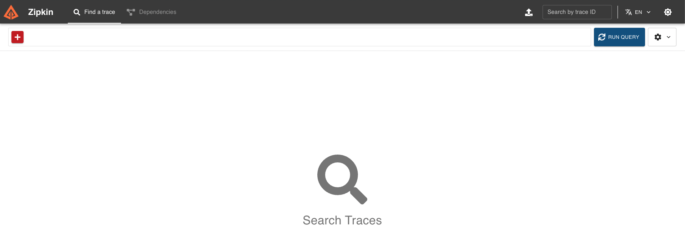
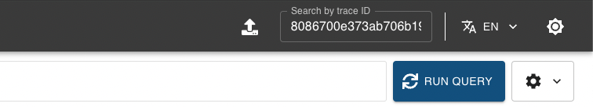
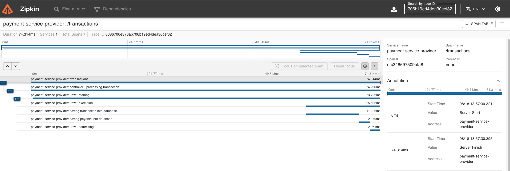

<h1 align="center">PSP</h1>

## 📜 Summary
- [About](#About)
- [Libs/Dependencies](#Libs/Dependencies)
- [Run](#Run)
- [Endpoints](#Endpoints)
- [Tests](#Tests)
- [Tracing](#Tracing)


<a id="About"></a> 
## 📃 About
This code is a simple PSP (payment service provider). The two main functions of it is: allow clients to process transations(cash-in) and 
and make the payable payments to the clients. After running the project, check it out the <a href="#Endpoints">endpoints</a> section. To run this project you need to have docker installed on your machine. 

---
<a id="Libs/Dependencies"></a> 
## 🗄 Libs/Dependencies </br>

| Name        | Description | Documentation | Installation |
| ----------- | ----------- | ------------- | ----------- |     
| pgx      | postgres database driver       |  github.com/jackc/pgx/v4 |  go get github.com/jackc/pgx/v4      |
| chi               |  http router  lib | https://github.com/go-chi/chi                   | go get github.com/go-chi/chi   |
| godotenv             | .env vars manager              | github.com/joho/godotenv             | go get github.com/joho/godotenv    | 
|  testcontainers     | create a container to do integration tests                          |  https://golang.testcontainers.org/quickstart/                                | go get github.com/testcontainers/testcontainers-go
| testcontainers-postgres                     | postgres database module to use with testcontainers               | https://golang.testcontainers.org/modules/postgres/             | go get github.com/testcontainers/testcontainers-go/modules/postgres     
|sqlc         | SQL code generator            | https://docs.sqlc.dev/en/stable/tutorials/getting-started-postgresql.html               | go install github.com/sqlc-dev/sqlc/cmd/sqlc@latest
|golang-migrate                | databasa migration                       | https://github.com/golang-migrate/migrate                             | https://github.com/golang-migrate/migrate/blob/master/cmd/migrate/README.md
|testify | tools test library                          | https://github.com/stretchr/testify                             | go get github.com/stretchr/testify
| otel API          | open telemetry API lib           | https://pkg.go.dev/go.opentelemetry.io/otel                    | go get go.opentelemetry.io/otel
| otel Trace              | otel tracing package               | https://pkg.go.dev/go.opentelemetry.io/otel/trace                   | go get go.opentelemetry.io/otel/trace
| otel attribute              | sets spans attributes                 | https://pkg.go.dev/go.opentelemetry.io/otel/attribute                    | go get go.opentelemetry.io/otel/attribute 
| otel codes              | lib that changes spans codes                 |https://pkg.go.dev/go.opentelemetry.io/otel/codes                    | go get go.opentelemetry.io/otel/codes
|otel propagation               | lib that contains the context propagation                | https://pkg.go.dev/go.opentelemetry.io/otel/propagation                   | go get go.opentelemetry.io/otel/propagation
| otel Zipkin              | Zipkin SDK to Go                 | https://pkg.go.dev/go.opentelemetry.io/otel/exporters/zipkin                    | go get go.opentelemetry.io/otel/exporters/zipkin
| otel resource              | api that providers resources                | https://pkg.go.dev/go.opentelemetry.io/otel/sdk/resource | go get go.opentelemetry.io/otel/sdk/resource
| otel semconv              | lib that implements otel conventions                 | https://pkg.go.dev/go.opentelemetry.io/otel/semconv/v1.17.0                   | go get go.opentelemetry.io/otel/semconv/v1.17.0

---
<a id="Run"></a> 
## ⚙️ Run

There's two ways of starting this project: using docker to start the webserver and the database on containers or start the database via docker and starting the server locally on your machine.

### Using docker for database and webserver

Run one of the commands below to build golang image:

```bash
docker-compose -f docker-compose.production.yml build
```

```bash
make build
```

Then run one of the commands below to start the containers:

```bash
docker-compose -f docker-compose.production.yml up -d
```

```bash
make run_prod
```

If you want to destroy it all, run one of the commands below:

```bash
docker-compose -f docker-compose.production.yml down
```

```bash
make down
```

### Using docker for database and webserver locally

Run one of the commands below to start the database:

```bash
docker compose up -d
```

```bash
make infra_up
```

then start the api:

```bash
go run main.go
```

```bash
make run
```

If you want to destroy the database's docker, run one of the commands below:

```bash
docker compose down 
```

```bash
make infra_down
```

<a id="Endpoints"></a> 
## 💻 Endpoints

<h4>Create a transaction</h4>

Request: 

```bash
curl --location 'localhost:3000/transactions' \
--header 'Content-Type: application/json' \
--data '{
    "client_id": "720c158e-4870-4760-be11-9ab6be695b76",
    "value": 100.0,
    "description": "transaction test",
    "payment_method": "credit_card",
    "card": {
        "number": "1111-1111-1111-1111",
        "verification_code": "123",
        "owner_name": "Teste da Silva",
        "valid_date": "2030-11-10T15:04:05Z"
    }
}'
```

Response: 

statusCode: 201<br>
```bash
{
    "trace_id": "8086700e373ab706b19ed4dea30cef32",
    "data": {},
    "error": ""
}
```

<h4>List all the transactions that a client has by its ID.</h4>

Request:

```bash
curl --location 'localhost:3000/transactions/{client_id}' \
--data ''
```

Response:

statusCode: 200<br>
body: 

```bash
{
    "trace_id": "f31f8e1851321ba80c5e722097d61885",
    "data": [
        {
            "id": "8320d49a-4cbe-410b-9112-b10b07ca2783",
            "client_id": "720c158e-4870-4760-be11-9ab6be695b76",
            "description": "transaction test",
            "value": 100,
            "card_owner_name": "Teste da Silva",
            "card_verification_name": "123",
            "card_last_digits": "1111",
            "card_valid_date": "2030-11-10T15:04:05Z",
            "payment_method": "credit_card",
            "created_at": "2024-08-18T16:57:30.321Z"
        }
    ],
    "error": ""
}
```

<h4>Report all 'available' and 'wait_funds' that the client has.</h4> 

Available is all the payables that the client
already received and wait_funds are the payable that the client will receive in 30 days.

Request:

```bash
 curl --location 'localhost:3000/balance/{client_id}' \
    --data ''
```

Response:

statusCode: 200<br>
body:

```bash
{
    "trace_id": "a6527e0f86ccc0d3ca4ef76efd3eb17e",
    "data": {
        "balance": {
            "available": 97,
            "wait_funds": 95
        }
    },
    "error": ""
}
```

<a id="Tests"></a> 
## 🧪 Tests

All tests

```bash
make test
```

Unit tests

```bash
make test-unit
```

Integration tests

```bash
make test-integration
```

<a id="Tracing"></a> 
## 🔬 Tracing

This api is monitored with tracing. The exporter that is being used is the "Zipkin". We use Dokcer to run it.
All the endpoints has the traceID in the body of the request response, so you just need access it and search the trace
using the traceID. Explanation about how to do it below:</br></br>

1. With your browser, go to zipkin homepage on http://localhost:9411/zipkin/ </br></br>
    

2. Search in the search bar using the traceID. The search bar is up the right corner in the screen. The traceID can be found at the 
response of any request. See the <a href="#Endpoints">endpoints</a> section for more information.</br></br>
    

3. Check out all the spans that the endpoint produced. </br></br>
    